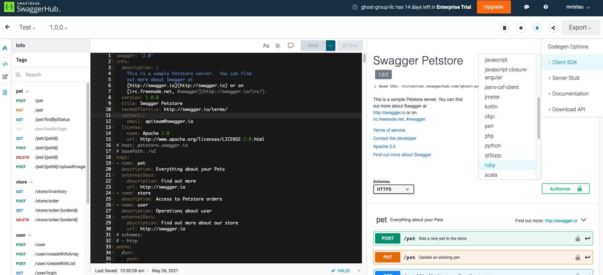

# swaggerhub-generator-demo

This repository contains 3 projects generated by SwaggerHub:

| Plugin | README |
| ------ | ------ |
| Typescript/Fetch Client SDK | [typescript-fetch-client-generated](typescript-fetch-client-generated) |
| Ruby Client SDK | [ruby-client-generated](ruby-client-generated) |
| Rails API server | [rails5-server-generated](rails5-server-generated) |

Each project was generated via the SwaggerHub service as shown in the screenshot below, using the "Swagger Petstore" API spec.

